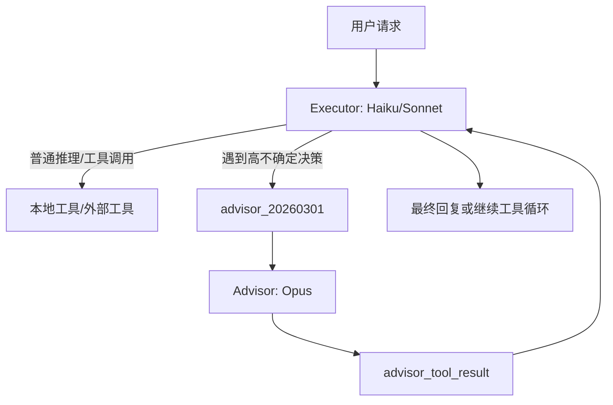
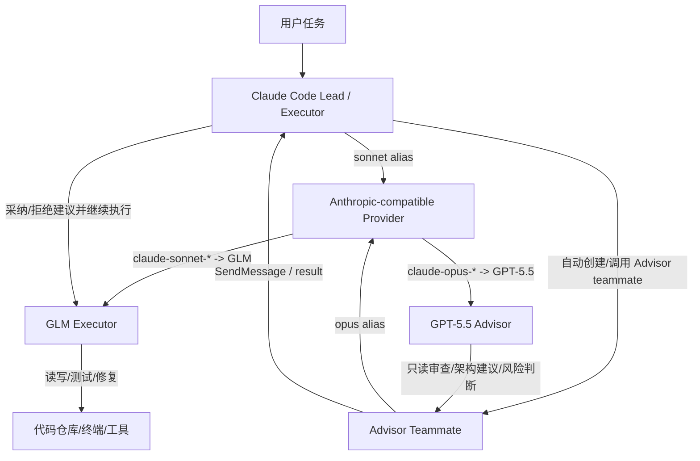

# Claude Code Teams 纯客户端 Advisor 工作流：当前会话导出

导出时间：2026-05-19  
说明：本文件根据当前会话可见内容整理，包含用户问题原文、回答原文/整理版、Deep Research 调研报告主体摘要与后续落地方案。  
限制说明：Deep Research 报告在会话中以内嵌 UI/工具结果形式返回，当前导出保留了报告的核心结论、结构、来源线索与主要技术细节；若需要逐字逐句完整导出 Deep Research UI 中的全部原始长文，建议同时使用界面自带复制/导出能力补充。

---

# 一、问答原文与会话脉络

## 1. 用户问题：Anthropic 顾问模式原理与生态支持

**用户原文：**

> Anthropic 顾问模式（弱模型主导工作，遇到困难问题时请教强模型解决问题）原理如何？具体是怎么实现的？
> ClaudeCode 如何实现顾问模式？如何在 ClaudeCode 中使用顾问模式？OpenCode、Codex 等 Coding Agent 有没有类似的支持？
> 针对第三方的 LLM Provider(DeepSeek, GLM, Qwen, MiniMax, Kimi) 能否实现顾问模式？有没有类似的开源项目已经实现了第三方 LLM Provider 的顾问模式？
> NewAPI、Sub2API、CLIProxyAPI 等开源项目或者类似的开源项目有没有实现顾问模式？

**助手动作：**

启动 Deep Research 调研，主题为：

> Anthropic 顾问模式（弱模型主导工作，遇到困难问题时请教强模型解决问题）原理如何？具体是怎么实现的？ClaudeCode 如何实现顾问模式？如何在 ClaudeCode 中使用顾问模式？OpenCode、Codex 等 Coding Agent 有没有类似的支持？针对第三方 LLM Provider(DeepSeek, GLM, Qwen, MiniMax, Kimi) 能否实现顾问模式？有没有类似的开源项目已经实现了第三方 LLM Provider 的顾问模式？NewAPI、Sub2API、CLIProxyAPI 等开源项目或者类似的开源项目有没有实现顾问模式？

---

## 2. 用户追问：client-side tool use 是否可实现类似 advisor

**用户原文：**

> 按照你的调研结果，Anthropic advisor 是 server_tool_use。那么对于第三方 llm provider 或者第三方 coding agent 来讲，是不是可以构建类似 client tool use 来实现更好的兼容性？
> 比如，claude code teammate 等能力能否实现 advisor 差不多的效果？
> 罗列所有可能的第三方实现方案，包括 server 实现、客户端完整实现、三方 hack 等方式。
> 我想要的核心是 agent 自主判断和调用顾问，而不是人工判断，手动切换。

**助手动作：**

继续 Deep Research，补充调研方向：

> 在已有调研基础上，进一步深入分析：
> 1）第三方 LLM Provider 或第三方 Coding Agent 是否可以通过 client-side tool use 实现类似 Anthropic advisor（server_tool_use）的能力？
> 2）如何设计一个“Agent 自主判断 + 自动调用顾问模型”的架构，而不是人工切换模型？
> 3）系统性罗列所有可能的第三方实现方案：包括 server 侧实现、客户端完整实现、proxy / gateway 实现、三方 hack 方式等，并分析优缺点。
> 4）评估 claude code teammate 等能力是否可以实现类似 advisor 的效果。
> 5）分析针对 DeepSeek、GLM、Qwen、MiniMax、Kimi 等第三方 LLM Provider 实现顾问模式的可行性，以及是否已有开源项目实现。
> 6）分析 NewAPI、Sub2API、CLIProxyAPI 等开源项目是否支持或可扩展实现顾问模式。
> 重点：必须围绕“Agent 自主判断 + 自动调用顾问”这一核心机制展开。

---

## 3. 用户问题：ClaudeCode Teams 实现类 Advisor，GLM executor，GPT-5.5 advisor

**用户原文：**

> 如何基于 ClaudeCode Teams 实现类 Advisor 模式，GLM 做 executor, gpt-5.5 做 advisor。
> 要求：executor 根据情况自动触发 advisor, 不需要人工参与顾问过程。
> 给我详细可操作的生产级操作建议。

**助手动作：**

继续 Deep Research，补充调研方向：

> 如何基于 ClaudeCode Teams 实现类 Advisor 模式，GLM 做 executor, GPT-5.5 做 advisor。要求：executor 根据情况自动触发 advisor，不需要人工参与顾问过程。请给出详细、可操作、生产级架构设计与落地建议，包括：1）ClaudeCode Teams 下的整体架构图；2）Agent 自主触发 advisor 的判定机制设计（风险评分、失败重试、阶段钩子等）；3）多模型编排与上下文同步策略；4）成本与延迟控制；5）网关/代理层改造建议；6）可观测性与审计；7）灰度与回滚策略；8）示例伪代码与配置示例。

---

## 4. 用户补充约束：纯客户端 Teams 实现

**用户原文：**

> 纯客户端 Teams 实现，不依赖服务端 server_tool_use 调用。

**助手动作：**

继续 Deep Research，补充要求：

> 必须是纯客户端 ClaudeCode Teams 实现，不依赖 Anthropic server_tool_use / advisor_20260301。请设计完全 client-side 的自动 Advisor 架构（GLM 作为 executor，GPT-5.5 作为 advisor），Agent 自主判断触发 advisor，不需要人工参与顾问过程。需要生产级详细方案，包括架构图、触发策略、状态机设计、上下文同步、成本与延迟控制、失败模式、可观测性、灰度与回滚、示例伪代码与配置示例。

---

## 5. 用户补充关键条件：Anthropic-compatible LLM Provider 可映射 opus/sonnet/haiku

**用户原文：**

> 我有一个 Anthropic complatable LLM Provider 可以提供几乎所有厂家的模型，ClaudeCode 支持通过环境变量把 opus/sonnet/haiku 设置为第三方模型。
> 跟据这个信息更新 用 Claude Code Teams 纯客户端实现 Advisor 工作流 的实现方案。

**助手回答原文整理：**

可以，按你这个补充条件，方案要明显调整：**不再建议 Claude Code 外部再单独直连 GLM / OpenAI API 做双调度**，而是让 **Claude Code Teams 原生负责 teammate 编排**，让你的 **Anthropic-compatible LLM Provider 负责把 Claude 的 opus / sonnet / haiku 语义映射到第三方模型**。

核心方案变成：

> **Claude Code Lead / Executor 使用 sonnet alias → 实际路由到 GLM**  
> **Advisor teammate 使用 opus alias → 实际路由到 GPT-5.5**  
> **自动触发逻辑由 Claude Code Teams + hooks + prompt policy 完成**  
> **全程不依赖 Anthropic server_tool_use / advisor_20260301**

---

# 二、Deep Research 调研报告主体整理

## 1. 执行摘要

Anthropic 的 “advisor” 并不是泛指的“规划模式”，而是一个 **服务端工具**：执行模型继续作为主循环的大脑，但在遇到高不确定、高代价决策时，可以在同一个 `/v1/messages` 请求里调用 `advisor_20260301`，把当前对话上下文发给一个更强的顾问模型，请它返回建议，然后再由执行模型继续完成本轮推理与工具使用。

官方典型组合是：

- Haiku / Sonnet 作为 executor；
- Opus 作为 advisor；
- advisor 是 server-side tool；
- advisor 只给建议，不直接执行工具；
- executor 仍然是主循环控制者。

关键结论：

1. Anthropic advisor 是 **server-side tool / server_tool_use**。
2. 它不是多 agent 框架，而是把 planner / reviewer 内联为一个受限工具。
3. advisor 没有工具权限，只返回建议。
4. 该能力当前主要在 Claude API / Claude Platform on AWS 可用。
5. Claude Code 已经出现实验性 Advisor Tool 集成，但公共命令文档中 `/advisor` 的稳定状态仍需谨慎看待。
6. 第三方 provider 基本没有等价 server-side advisor，需要在客户端、agent harness 或 proxy 层自行编排。
7. OpenCode、Codex、Aider、Roo Code、Cline、Cursor 可以模拟类似模式，但多数不是单请求内联 advisor，而是 reviewer / architect / subagent / plan-act 组合。
8. NewAPI、Sub2API、CLIProxyAPI 更像协议兼容层，不是 advisor 编排层；要实现 advisor，需要额外做 orchestration。

---

## 2. Anthropic Advisor 的实现机制

原生 advisor 请求大致结构：

```json
{
  "model": "claude-sonnet-4-6",
  "max_tokens": 4096,
  "tools": [
    {
      "type": "advisor_20260301",
      "name": "advisor",
      "model": "claude-opus-4-7",
      "max_uses": 2
    }
  ],
  "messages": [
    {
      "role": "user",
      "content": "复杂任务描述"
    }
  ]
}
```

请求头需要：

```http
anthropic-version: 2023-06-01
anthropic-beta: advisor-tool-2026-03-01
```

执行流程：



核心约束：

- advisor 输入通常为空对象，因为它读取当前上下文；
- advisor 没有工具权限；
- advisor 不接收 context_management 设置；
- thinking block 不会完整传给 advisor；
- 多轮对话中，需要保留并回放 advisor 相关 content block；
- advisor 调用会增加延迟和 token 成本；
- 官方建议复杂任务中早期咨询一次，完成前再咨询一次。

---

## 3. Claude Code 中的 Advisor 状态

调研结论：

- Claude Code changelog 中出现过 `Advisor Tool (experimental)`。
- 社区 issue 显示 Claude Code 可能已经向 API 发送 `advisor-tool-2026-03-01` beta header。
- LiteLLM 等兼容层出现过与 `/advisor` toggle、beta header、custom `ANTHROPIC_BASE_URL` 有关的问题。
- 公开 Commands 文档中未稳定列出 `/advisor` 命令，因此应把它视为实验功能。

对于使用自定义 Anthropic-compatible gateway 的场景，最大风险不是模型本身，而是协议兼容性：

- `anthropic-beta` 是否透传；
- `anthropic-version` 是否透传；
- `/v1/messages` 结构是否完全兼容；
- `server_tool_use` / `advisor_tool_result` 是否保真；
- 多轮 content block 是否能回传；
- streaming 是否兼容；
- count_tokens 是否兼容。

如果不依赖 server_tool_use，则这些风险可以大幅降低，但仍然需要 Claude Code Teams、subagents、hooks、tool_use 等基础协议兼容。

---

## 4. 第三方 Coding Agent 的类似能力

| 工具 | 是否有原生 advisor | 接近机制 | 评价 |
|---|---|---|---|
| Claude Code | 有实验性 Advisor Tool | `/advisor` / Teams / subagents / hooks | 最接近 Anthropic 原生生态 |
| OpenAI Codex | 无原生 advisor | subagents、review、custom agents | 可编程性强，适合做 reviewer/advisor 工作流 |
| OpenCode | 无原生 advisor | Build/Plan/Explore agents | 适合模拟 executor/advisor，但不等价 server_tool_use |
| Aider | 无 server advisor，但有成熟双模型 | Architect / Editor | 非常接近 advisor 思路 |
| Roo Code | 无原生 advisor | Architect / Orchestrator / Boomerang | 可做规划顾问与任务分派 |
| Cline | 无原生 advisor | Plan & Act / Deep Planning | 适合阶段式顾问 |
| Cursor | 无原生 advisor | Plan Mode / Subagents / Agent Review | 产品层接近，但非协议级 advisor |

结论：

> 如果目标是“行为收益”，不必追求 Anthropic 原生协议。可通过 planner/reviewer/architect + executor 的多模型编排复现大部分收益。

---

## 5. 第三方 LLM Provider 可行性

针对 DeepSeek、GLM、Qwen、MiniMax、Kimi：

| Provider | 可行性 | 适合角色 | 说明 |
|---|---|---|---|
| DeepSeek | 高 | executor 或 advisor | OpenAI 兼容、函数调用、成本低 |
| GLM | 高 | executor | 企业 API 能力较全，适合低成本执行 |
| Qwen | 高 | executor / advisor | OpenAI-compatible、function calling、structured output |
| MiniMax | 中高 | executor | 成本低，适合大量执行回合 |
| Kimi | 中高 | long-context advisor | 长上下文、工具调用能力适合审查大仓库 |

核心判断：

> 这些 provider 通常没有 Anthropic 原生 advisor_20260301 等价物，但可以通过客户端 / agent harness / gateway 双模型编排实现“行为等价”。

---

## 6. NewAPI、Sub2API、CLIProxyAPI 等网关项目

调研结论：

- NewAPI：多 provider 聚合与 Claude/OpenAI/Gemini 转换能力较强，但主要是协议兼容层，不是 advisor 编排层。
- Sub2API：更偏订阅额度分发与 relay/gateway，未见明确 advisor 编排实现。
- CLIProxyAPI：面向 AI coding tools 的代理生态活跃，但 issue 中暴露过 Anthropic beta header 与 Claude Code 新请求形状的兼容问题。
- LiteLLM：有 advisor rollout 相关讨论，但更偏兼容性支持，不等同于内置 advisor 编排。

总体结论：

> 这些项目可以作为模型路由层、协议兼容层、计费统计层，但如果要实现自动 Advisor，需要额外实现 orchestration policy、risk gate、context packaging 和 reviewer feedback loop。

---

# 三、纯客户端 Claude Code Teams Advisor 方案

## 1. 目标

你希望实现：

- 不依赖 Anthropic server_tool_use；
- 不依赖 `advisor_20260301`；
- Claude Code Teams 纯客户端实现；
- GLM 做 executor；
- GPT-5.5 做 advisor；
- executor 根据情况自动触发 advisor；
- 用户不需要手动判断、不需要手动切换模型。

---

## 2. 最终推荐架构



核心设计：

```text
Claude Code Teams = 客户端编排器
Anthropic-compatible Provider = Claude alias 到真实模型的路由层
GLM = sonnet executor
GPT-5.5 = opus advisor
Hooks = 自动触发和强制质量门禁
Subagent definition = advisor 只读角色约束
Provider observability = 成本、延迟、命中率、审计
```

---

## 3. Provider 模型映射

建议在 Provider 层维护稳定 alias：

```yaml
model_routes:
  claude-sonnet-4-6:
    provider: zhipu
    model: glm-4.7
    role: executor

  claude-opus-4-7:
    provider: openai
    model: gpt-5.5
    role: advisor

  claude-haiku-4-5:
    provider: zhipu
    model: glm-flash
    role: lightweight
```

不要把真实模型名直接暴露给 Claude Code。

---

## 4. Claude Code 环境变量

```bash
export ANTHROPIC_BASE_URL="https://llm-gateway.example.com"
export ANTHROPIC_AUTH_TOKEN="sk-your-gateway-token"

# 默认会话模型：sonnet alias，实际路由到 GLM
export ANTHROPIC_MODEL="claude-sonnet-4-6"

# sonnet 语义位：executor
export ANTHROPIC_DEFAULT_SONNET_MODEL="claude-sonnet-4-6"

# opus 语义位：advisor
export ANTHROPIC_DEFAULT_OPUS_MODEL="claude-opus-4-7"

# haiku 语义位：轻量任务
export ANTHROPIC_DEFAULT_HAIKU_MODEL="claude-haiku-4-5"

# 启用 Claude Code Teams
export CLAUDE_CODE_EXPERIMENTAL_AGENT_TEAMS=1

# 可选：关闭 attribution header，避免影响网关缓存/日志
export CLAUDE_CODE_ATTRIBUTION_HEADER=0
```

如果你的网关不完整支持 Anthropic beta 字段，可临时：

```bash
export CLAUDE_CODE_DISABLE_EXPERIMENTAL_BETAS=1
```

但生产建议是优先修网关，而不是长期关闭 beta。

---

## 5. Advisor teammate 定义

创建：

```bash
mkdir -p .claude/agents
```

文件：`.claude/agents/gpt55-advisor.md`

```markdown
---
name: gpt55-advisor
description: Strong read-only advisor for architecture, debugging, risk review, and final verification.
model: claude-opus-4-7
tools: Read, Glob, Grep
---

你是只读顾问，不是执行器。

职责：
- 审查 executor 的方案是否有遗漏；
- 评估代码修改的风险、影响面、回滚难度；
- 分析失败测试或异常日志的根因；
- 给出最小化修改建议和验证清单；
- 对最终结果做 release-gate 审查。

禁止：
- 不要 Write/Edit/MultiEdit；
- 不要 Bash；
- 不要提交代码；
- 不要直接替 executor 完成实现；
- 不要输出大段 patch，除非只是解释局部建议。

输出格式固定：

## 判断
继续 / 暂停 / 回滚 / 缩小范围

## 风险等级
低 / 中 / 高 / 阻断

## 主要风险
- ...

## 建议
- ...

## 必须验证
- ...

## 给 executor 的下一步指令
一段简短、可执行的指令。
```

---

## 6. 自动触发策略

触发分四层。

### 第一层：Prompt Policy

启动任务时要求：

```text
使用 Agent Teams 完成本任务。

团队结构：
1. Lead/Executor：你自己，使用当前模型，也就是 sonnet alias。负责读取、修改、测试和最终交付。
2. Advisor：请创建一个 teammate，名称固定为 Advisor，使用 gpt55-advisor agent type，也就是 opus alias。Advisor 只读，不执行修改。

自动顾问规则：
- 跨模块重构、认证鉴权、数据库、部署、CI/CD、容器、K8s、中间件配置修改前，必须自动咨询 Advisor。
- 连续两次失败后，必须自动咨询 Advisor。
- 测试结果无法解释时，必须自动咨询 Advisor。
- 任务完成前，必须自动咨询 Advisor 做最终审查。
- hooks 如果提示 ADVISOR_REQUIRED 或 FINAL_ADVISOR_REVIEW_REQUIRED，必须立即咨询 Advisor，不要询问我是否需要。
- Advisor 的建议由你判断采纳，但你必须说明采纳/拒绝原因。
- 不需要我人工参与顾问过程。

现在开始执行：<任务>
```

### 第二层：PreToolUse hook

用于高风险工具调用前强制阻断。

触发条件：

- `rm -rf`
- `kubectl delete/apply`
- `helm upgrade/uninstall`
- `docker compose down`
- `docker system prune`
- 数据库 `drop/truncate/alter`
- `chmod -R`
- 修改：
  - Dockerfile
  - docker-compose
  - k8s/helm
  - Jenkinsfile
  - SQL migration
  - auth/security/gateway
  - Nacos/Sentinel/SkyWalking/Elasticsearch 配置
  - application-prod.yml
  - `.env`

### 第三层：失败触发

触发条件：

- 同一个测试连续失败 2 次；
- 同一问题修复失败 2 次；
- 同一文件反复改动 3 次；
- executor 输出“不确定”“可能”“无法判断根因”等不确定性信号。

### 第四层：完成前触发

`TaskCompleted` hook 强制 final advisor review。

---

## 7. Hook 配置示例

`.claude/settings.json`：

```json
{
  "env": {
    "CLAUDE_CODE_EXPERIMENTAL_AGENT_TEAMS": "1",
    "ANTHROPIC_BASE_URL": "https://llm-gateway.example.com",
    "ANTHROPIC_AUTH_TOKEN": "sk-your-gateway-token",
    "ANTHROPIC_MODEL": "claude-sonnet-4-6",
    "ANTHROPIC_DEFAULT_SONNET_MODEL": "claude-sonnet-4-6",
    "ANTHROPIC_DEFAULT_OPUS_MODEL": "claude-opus-4-7",
    "ANTHROPIC_DEFAULT_HAIKU_MODEL": "claude-haiku-4-5",
    "CLAUDE_CODE_ATTRIBUTION_HEADER": "0"
  },
  "hooks": {
    "PreToolUse": [
      {
        "matcher": "Bash|Edit|Write|MultiEdit",
        "hooks": [
          {
            "type": "command",
            "command": "$CLAUDE_PROJECT_DIR/.claude/hooks/advisor-gate.sh"
          }
        ]
      }
    ],
    "TaskCompleted": [
      {
        "matcher": "*",
        "hooks": [
          {
            "type": "command",
            "command": "$CLAUDE_PROJECT_DIR/.claude/hooks/final-advisor-review.sh"
          }
        ]
      }
    ]
  }
}
```

---

## 8. advisor-gate.sh

`.claude/hooks/advisor-gate.sh`：

```bash
#!/usr/bin/env bash
set -euo pipefail

INPUT="$(cat)"
TOOL_NAME="$(echo "$INPUT" | jq -r '.tool_name // ""')"
COMMAND="$(echo "$INPUT" | jq -r '.tool_input.command // ""')"
FILE_PATH="$(echo "$INPUT" | jq -r '.tool_input.file_path // ""')"

risk=0
reasons=()

if [[ "$TOOL_NAME" == "Bash" ]]; then
  if echo "$COMMAND" | grep -Eqi 'rm -rf|drop database|truncate table|kubectl delete|helm uninstall|docker system prune|chmod -R|chown -R'; then
    risk=$((risk+50))
    reasons+=("命令包含高危操作")
  fi

  if echo "$COMMAND" | grep -Eqi 'kubectl|helm|docker|podman|docker-compose|jenkins|nacos|sentinel|skywalking|elasticsearch'; then
    risk=$((risk+20))
    reasons+=("涉及基础设施或中间件")
  fi
fi

if [[ "$TOOL_NAME" =~ ^(Edit|Write|MultiEdit)$ ]]; then
  if echo "$FILE_PATH" | grep -Eqi 'docker-compose|Dockerfile|k8s|helm|jenkins|migration|sql|auth|security|gateway|nacos|sentinel|skywalking|elasticsearch|\.env|application.*ya?ml'; then
    risk=$((risk+35))
    reasons+=("修改高风险文件")
  fi
fi

STATE_DIR=".claude/advisor-state"
mkdir -p "$STATE_DIR"
FAIL_COUNT_FILE="$STATE_DIR/fail-count"
fail_count=0
[[ -f "$FAIL_COUNT_FILE" ]] && fail_count="$(cat "$FAIL_COUNT_FILE")"

if [[ "$fail_count" -ge 2 ]]; then
  risk=$((risk+30))
  reasons+=("连续失败次数 >= 2")
fi

if [[ "$risk" -ge 50 ]]; then
  {
    echo "ADVISOR_REQUIRED"
    echo
    echo "当前操作风险评分：$risk"
    echo "触发原因："
    for r in "${reasons[@]}"; do
      echo "- $r"
    done
    echo
    echo "在继续执行前，请先向名为 Advisor 的 gpt55-advisor teammate 发送咨询消息。"
    echo "咨询内容必须包含："
    echo "1. 准备执行的操作；"
    echo "2. 涉及文件/命令；"
    echo "3. 预期收益；"
    echo "4. 风险与回滚方案；"
    echo "5. 你希望 Advisor 判断的问题。"
    echo
    echo "收到 Advisor 回复后，说明采纳/拒绝哪些建议，再重新发起工具调用。"
  } >&2
  exit 2
fi

exit 0
```

---

## 9. final-advisor-review.sh

`.claude/hooks/final-advisor-review.sh`：

```bash
#!/usr/bin/env bash
set -euo pipefail

STATE_DIR=".claude/advisor-state"
mkdir -p "$STATE_DIR"

REVIEW_FLAG="$STATE_DIR/final-review-done"

if [[ ! -f "$REVIEW_FLAG" ]]; then
  {
    echo "FINAL_ADVISOR_REVIEW_REQUIRED"
    echo
    echo "在标记任务完成前，必须请 Advisor teammate 做最终审查。"
    echo
    echo "请发送给 Advisor："
    echo "1. 本次修改摘要；"
    echo "2. 修改文件列表；"
    echo "3. 已执行的测试命令与结果；"
    echo "4. 未覆盖风险；"
    echo "5. 回滚方案。"
    echo
    echo "Advisor 回复后，如果判断为继续，请创建文件："
    echo "$REVIEW_FLAG"
    echo
    echo "然后再完成任务。"
  } >&2
  exit 2
fi

exit 0
```

更严格的做法是 hook 解析 transcript，确认最近一次 Advisor teammate 消息包含 `## 判断: 继续` 或 `APPROVED`，再自动写 flag，而不是让 executor 自己写 flag。

---

## 10. Provider 路由伪代码

```python
def route_model(request):
    model = request["model"]
    headers = request["headers"]

    session_id = headers.get("X-Claude-Code-Session-Id")
    agent_id = headers.get("X-Claude-Code-Agent-Id")
    parent_id = headers.get("X-Claude-Code-Parent-Agent-Id")

    if model in ["claude-opus-4-7", "claude-opus-4-6"]:
        return {
            "provider": "openai",
            "model": "gpt-5.5",
            "role": "advisor",
            "budget": "high"
        }

    if model in ["claude-sonnet-4-6", "claude-sonnet-4-5"]:
        return {
            "provider": "zhipu",
            "model": "glm-4.7",
            "role": "executor",
            "budget": "normal"
        }

    if model in ["claude-haiku-4-5"]:
        return {
            "provider": "zhipu",
            "model": "glm-flash",
            "role": "lightweight"
        }

    return default_route()
```

---

## 11. Provider 侧观测字段

```json
{
  "session_id": "...",
  "agent_id": "...",
  "parent_agent_id": "...",
  "claude_alias": "claude-opus-4-7",
  "actual_model": "gpt-5.5",
  "role": "advisor",
  "trigger": "pre_tool_risk|failed_attempts|final_review|manual_policy",
  "input_tokens": 12345,
  "output_tokens": 1200,
  "latency_ms": 18000,
  "cost_usd": 0.23,
  "decision": "continue|pause|rollback|narrow_scope"
}
```

建议统计指标：

- advisor 调用次数；
- advisor 触发原因；
- advisor 成本；
- advisor 延迟；
- advisor 是否改变执行方案；
- advisor 阻断率；
- 最终任务成功率；
- 回滚率；
- 每个 agent_id 的成本；
- 每个 session_id 的成本。

---

## 12. 成本控制

建议默认：

```yaml
advisor_policy:
  max_advisor_calls_per_task: 3
  max_advisor_calls_per_hour: 20
  max_advisor_input_tokens: 30000
  max_advisor_output_tokens: 3000
  advisor_cooldown_seconds: 90
  require_final_review: true
```

Advisor 输入不要无脑复制完整 transcript，只提供：

1. 任务目标；
2. 当前方案；
3. 修改文件列表；
4. 关键 diff 摘要；
5. 测试失败摘要；
6. executor 的疑问；
7. 希望 advisor 判断的问题。

---

## 13. 灰度与回滚

灰度：

```text
第 1 周：只在 1 个仓库启用，advisor 只读，不阻断；
第 2 周：高风险 Bash / 配置文件修改前阻断；
第 3 周：TaskCompleted 前强制 final review；
第 4 周：推广到核心项目。
```

回滚：

```bash
# 关闭 Teams
unset CLAUDE_CODE_EXPERIMENTAL_AGENT_TEAMS

# 关闭 hooks
mv .claude/settings.json .claude/settings.json.disabled

# 网关降级 advisor
# claude-opus-4-7 -> glm-4.7
```

---

# 四、最终生产建议

你的最新条件下，最优方案是：

```text
Claude Code Teams 做客户端团队编排；
Anthropic-compatible Provider 做 Claude alias 到真实模型的映射；
sonnet alias 路由 GLM，作为 executor；
opus alias 路由 GPT-5.5，作为 advisor；
advisor teammate 只读；
hooks 负责强制触发；
prompt policy 负责行为约束；
Provider 侧负责观测、预算、审计；
不依赖 Anthropic server_tool_use / advisor_20260301。
```

这个方案的本质：

> 不是复制 Anthropic 原生 advisor 协议，而是在 Claude Code Teams 的客户端编排层复现 advisor 的行为收益。

最重要的三个工程点：

1. **Advisor 只读**：不要让 GPT-5.5 直接改文件、执行命令。
2. **Hook 强制触发**：不要完全相信 GLM executor 会自觉请教顾问。
3. **Provider 语义路由**：Claude Code 只认 opus/sonnet/haiku，你的 Provider 负责映射真实模型。

---

# 五、可直接复制的最小落地清单

```bash
mkdir -p .claude/agents .claude/hooks .claude/advisor-state
```

创建：

```text
.claude/agents/gpt55-advisor.md
.claude/hooks/advisor-gate.sh
.claude/hooks/final-advisor-review.sh
.claude/settings.json
```

启动：

```bash
export ANTHROPIC_BASE_URL="https://llm-gateway.example.com"
export ANTHROPIC_AUTH_TOKEN="sk-your-gateway-token"
export ANTHROPIC_MODEL="claude-sonnet-4-6"
export ANTHROPIC_DEFAULT_SONNET_MODEL="claude-sonnet-4-6"
export ANTHROPIC_DEFAULT_OPUS_MODEL="claude-opus-4-7"
export ANTHROPIC_DEFAULT_HAIKU_MODEL="claude-haiku-4-5"
export CLAUDE_CODE_EXPERIMENTAL_AGENT_TEAMS=1
claude
```

任务 prompt：

```text
使用 Agent Teams 完成本任务。

团队结构：
1. Lead/Executor：你自己，使用当前模型，也就是 sonnet alias。负责读取、修改、测试和最终交付。
2. Advisor：请创建一个 teammate，名称固定为 Advisor，使用 gpt55-advisor agent type，也就是 opus alias。Advisor 只读，不执行修改。

自动顾问规则：
- 跨模块重构、认证鉴权、数据库、部署、CI/CD、容器、K8s、中间件配置修改前，必须自动咨询 Advisor。
- 连续两次失败后，必须自动咨询 Advisor。
- 测试结果无法解释时，必须自动咨询 Advisor。
- 任务完成前，必须自动咨询 Advisor 做最终审查。
- hooks 如果提示 ADVISOR_REQUIRED 或 FINAL_ADVISOR_REVIEW_REQUIRED，必须立即咨询 Advisor，不要询问我是否需要。
- Advisor 的建议由你判断采纳，但你必须说明采纳/拒绝原因。
- 不需要我人工参与顾问过程。

现在开始执行：<你的任务>
```

---

# 六、参考来源线索

本会话调研主要涉及以下资料方向：

- Anthropic Claude API Advisor Tool 文档；
- Claude Code changelog；
- Claude Code env vars；
- Claude Code LLM gateway；
- Claude Code Agent Teams；
- Claude Code hooks；
- Claude Code monitoring / OpenTelemetry；
- LiteLLM 与 Claude Code advisor 兼容 issue；
- NewAPI、Sub2API、CLIProxyAPI 相关 issue；
- OpenCode agents / models；
- Codex subagents / review / app server；
- Aider Architect / Editor；
- Roo Code modes；
- Cline Plan & Act；
- DeepSeek、GLM、Qwen、MiniMax、Kimi API 文档。

---

# 七、后续可继续深化的问题

1. 如何把 `.claude/hooks/advisor-gate.sh` 做成更准确的风险评分器？
2. 如何解析 Claude Code transcript，自动确认 Advisor 是否已经审查？
3. 如何在 Provider 层识别 Advisor teammate，而不仅仅依赖 opus alias？
4. 如何做 advisor 调用预算与熔断？
5. 如何把 Advisor 审查结果写入 PR comment / Git commit trailer？
6. 如何在 Jenkins / GitHub Actions 中复用同一套 Advisor gate？
7. 如何基于你的 Anthropic-compatible Provider 做统一的模型路由与审计面板？
